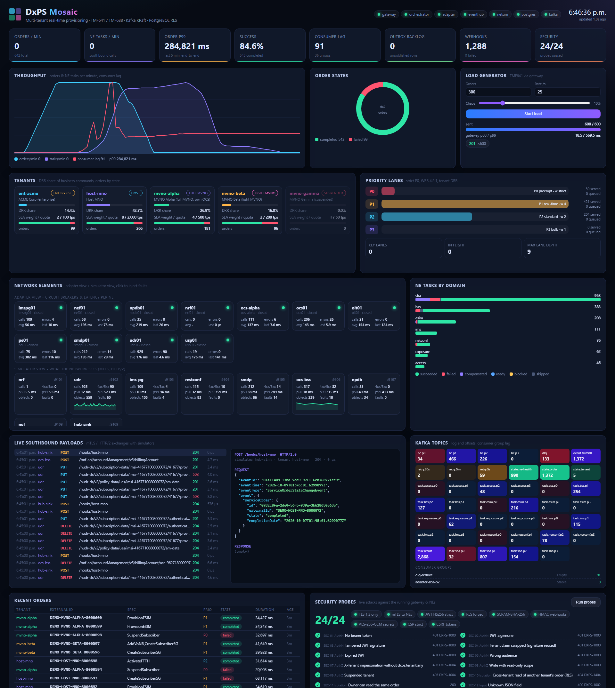
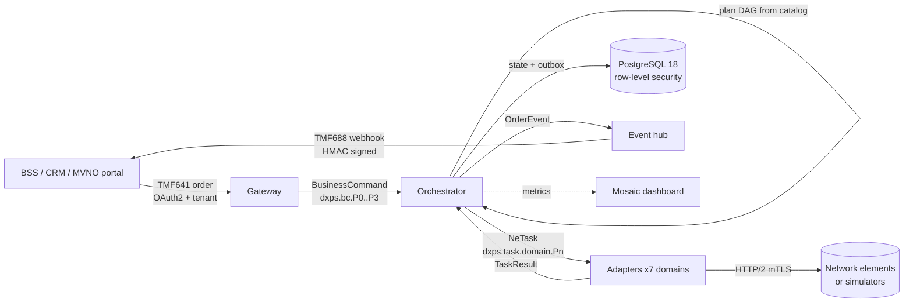

# DxPS - Real-time Provisioning System

DxPS turns a business order such as *"create a 5G subscriber with VoNR"* into the exact sequence of network
commands needed to fulfil it. It runs those commands against the network elements (5G core, IMS, eSIM, charging,
number portability, fixed access, transport and network APIs) in real time. It tracks every step and rolls back
cleanly when something fails.

It is built for an operator that hosts **MVNOs and enterprise customers on the same platform**. Each tenant gets
isolated data, its own priorities and quotas, and its own variants of the provisioning recipes.



---

## What it does

| Capability | Summary |
|---|---|
| **Northbound order API** | TMF641 Service Ordering (create / list / get / cancel) and TMF688 event-hub subscriptions over HTTPS, with OAuth2 tokens that carry the tenant. |
| **Order decomposition** | A YAML catalog describes each service as a DAG of network tasks with parameters, CEL conditions, dependencies and compensations. The planner resolves the tenant's own version first, then the global one. |
| **Real-time orchestration** | Tasks run in parallel where the DAG allows and in strict order where it doesn't. Work on the same subscriber or resource is serialised, so it never races. |
| **Transaction modes** | `ATOMIC` (all or nothing, with saga compensation in reverse order), `PARTIAL_ALLOWED` and `BEST_EFFORT`. |
| **Priority and fairness** | Four priority tiers. P0 is strict; P1-P3 are weighted 4:2:1. Tenants share each tier fairly (deficit round robin), so one noisy MVNO cannot starve the others. |
| **Resilient delivery** | Idempotent orders, exactly-once processing between Kafka and PostgreSQL (inbox, transactional outbox), a 5 s / 30 s / 5 min retry ladder, a dead-letter queue with re-drive, and per-NE circuit breakers and rate budgets. |
| **Southbound adapters** | Seven domain drivers: 5G SBA (UDM/UDR, PCF, SMF), IMS, NETCONF/RESTCONF, eSIM (GSMA ES2+), BSS/charging and NPDB, fixed access (TR-385 / TR-369 USP), and exposure (CAMARA / NEF). |
| **Event notifications** | Order state changes go to tenant webhooks as TMF688 events, signed with HMAC-SHA256, with bounded retries. |
| **Network simulators** | Realistic NE simulators over HTTP/2 with mutual TLS. They validate payloads, keep state per tenant, and support injected faults and latency, so the whole flow runs end to end without a real network. |
| **Mosaic dashboard** | A live operations view of tenants, priority lanes, Kafka topics and lag, orders, NE health and latency, payload exchanges, webhooks, security probes and test results. |

## How an order flows



1. The **gateway** authenticates the caller and gets the tenant from the token. It deduplicates on the client
   idempotency key, stores the order and publishes a `BusinessCommand` on the topic for its priority.
2. The **orchestrator** plans the order into a DAG of NE tasks using the tenant's catalog. It picks only network
   elements the tenant owns or is entitled to, then sends the ready tasks to the domain topics.
3. The **adapters** render the payload template and call the network element. They report back success, a
   transient error (retry), a rejection or downtime.
4. The orchestrator moves the DAG forward, retries through the retry ladder, or compensates already-completed steps
   in reverse order. It then sets the TMF641 order state (`acknowledged -> inProgress -> completed / failed / partial`).
5. The **event hub** sends each state change to the tenant's registered listeners.

## Services

| Service | Role | Default port |
|---|---|---|
| `gateway` | TMF641 / TMF688 northbound API (TLS 1.3, OAuth2 bearer tokens) | 8443 |
| `orchestrator` | Planning, DAG execution, retries, saga compensation, order state | 9201 (stats) |
| `adapter` | Southbound drivers for the 7 domains, NE budgets and circuit breakers | 9202 (stats) |
| `eventhub` | Signed TMF688 webhook delivery | 9203 (stats) |
| `netsim` | NE simulators: NRF, UDR, IMS, RESTCONF/USP, SM-DP+, OCS, NPDB, NEF/CAMARA, hub sink | 9101-9109, admin 9199 |
| `dashboard` | Mosaic live dashboard | 8088 |
| `dxpsctl` | Operations CLI: secrets, dev PKI, migrations, seeding, topics, tokens, DLQ re-drive, API calls, order trace, test report | - |

Infrastructure: **PostgreSQL 18** (TLS 1.3, SCRAM) and **Apache Kafka 4** (KRaft, no ZooKeeper).

## Provisioning catalog

| Service spec | Network tasks (simplified) |
|---|---|
| `CreateSubscriber5G` | UDM auth subscription -> AM data -> SMF selection -> PCF policy -> OCS account |
| `AddVoNR` | IMS private identity -> public identity -> MMTel service |
| `SuspendSubscriber` / `ChangePlan` / `DeleteSubscriber5G` | Barring, AM data plus bundle change, full ordered teardown |
| `ProvisionESIM` | SM-DP+ download order -> confirm order (cancel as compensation) |
| `PortInNumber` | NPDB port-in (delete as compensation) |
| `ActivateFTTH` | OLT/ONT YANG patch -> CPE via TR-369 USP |
| `CreateL3VPN` | PE router L3VPN via RESTCONF YANG patch |
| `QoDSession` | CAMARA Quality-on-Demand session via NEF |

Tenants can override any spec. For example, `mvno-alpha` runs its own OCS and adds a welcome bundle to
`CreateSubscriber5G`. No code changes are needed.

## Multi-tenancy

- Every table carries `tenant varchar(40)` with a composite primary key `(tenant, id uuid)`.
- PostgreSQL **row-level security** isolates tenants. The application role cannot bypass it; only a separate
  operations role can.
- Tenants can be a full MVNO, a light MVNO or an enterprise, each with its own quotas, priorities, NE
  entitlements and catalog variants. Suspended tenants are rejected at the gateway.
- Seed tenants: `host-mno`, `mvno-alpha`, `mvno-beta`, `ent-acme`, `mvno-gamma` (suspended).

## Security

- TLS 1.3 everywhere, and **mutual TLS** to every network element (ECDSA P-256 development CA).
- Strict JWT verification: HS256 only, no `alg=none`, and `iss`, `aud`, `exp`, `nbf` and tenant are required.
  Scopes are enforced per endpoint.
- Webhook secrets are encrypted at rest with AES-256-GCM, bound to the tenant. Callbacks must use https, be
  allow-listed and cannot follow redirects.
- Sensitive values are redacted in logs and payload traces. Secrets are generated locally and never committed.
- Scanned with `govulncheck` (no vulnerabilities) and `gosec` (no high or medium findings).

## Quality and results

| Metric | Result |
|---|---|
| Unit, integration and E2E tests | 177 / 177 pass (Windows and Ubuntu 24.04) |
| Statement coverage | 91.5 % of 4,196 statements |
| Live security and behaviour probes | 24 / 24 pass |
| Load run | 2,000 orders at 100 orders/s with 10 % injected NE faults: all accepted, outbox drained to 0 |

Full details, payloads and evidence: `DxPS_Test_Cases_and_Results.pdf`.

## Repository layout

| Path | Contents |
|---|---|
| `dxps/cmd/` | Service binaries and the `dxpsctl` CLI |
| `dxps/internal/` | Packages (gateway, orchestrator, planner, scheduler, keylane, saga, bus, store, adapter, netsim, dashboard, auth, pki, ...) with their tests |
| `dxps/internal/catalog/data/` | Service specs (YAML) and NE payload templates |
| `dxps/internal/store/migrations/` | PostgreSQL schema (tenant composite keys, RLS, partitions) |
| `dxps/scripts/` | Install / setup / run / test / security-scan scripts: `.ps1` for Windows, `.sh` for Ubuntu and macOS |
| `dxps/INSTALL.md` | Step-by-step installation and running guide |
| `dxps/docs/COMPONENTS.md` | How PostgreSQL, Kafka and each component are used, with real rows and messages |
| `DxPS_Components_and_Data_Guide.*` | Components and data guide (Word / PDF) |
| `DxPS_TO-BE_HLD_LLD.*` | TO-BE design, high- and low-level (Word / PDF) |
| `DxPS_Test_Cases_and_Results.*` | Test cases and results (Word / PDF) |
| `DxPS_Installation_and_Running_Guide.*` | Installation guide (Word / PDF) |
| `design/` | Generators for the documents and diagrams, and the delivery packager |

## Quick start

```bash
# Ubuntu 22.04/24.04 or macOS 13+ (normal user with sudo)
cd dxps
bash scripts/install-deps-ubuntu.sh   # or: bash scripts/install-deps-macos.sh
bash scripts/infra-setup.sh
bash scripts/run-all.sh
```

```powershell
# Windows 10/11
cd dxps
powershell -ExecutionPolicy Bypass -File scripts\install-deps-windows.ps1
powershell -ExecutionPolicy Bypass -File scripts\infra-setup.ps1
powershell -ExecutionPolicy Bypass -File scripts\run-all.ps1
```

Then open the Mosaic dashboard at http://127.0.0.1:8088. Run the tests with `scripts/test-all` and the security
scans with `scripts/sec-scan`, and stop everything with `scripts/infra-stop`. See `dxps/INSTALL.md` for the full
guide, including how to submit a sample order.
